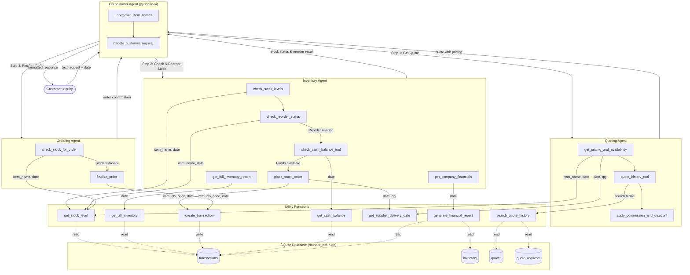

# Munder Difflin Multi-Agent System - Workflow Diagram



## Agent Architecture

| Agent | Framework | Tools | Role |
|-------|-----------|-------|------|
| **Orchestrator Agent** | pydantic-ai | `handle_customer_request` | Receives customer inquiries, normalizes item names, coordinates specialist agents sequentially |
| **Inventory Agent** | pydantic-ai | `check_stock_levels`, `check_reorder_status`, `place_stock_order`, `get_full_inventory_report`, `check_cash_balance_tool`, `get_company_financials` | Manages stock levels, assesses reorder needs, places stock orders, reports financials |
| **Quoting Agent** | pydantic-ai | `get_pricing_and_availability`, `quote_history_tool`, `apply_commission_and_discount` | Generates quotes with bulk discounts (5-15%), loyalty discounts (0-3%), and 5% sales commission |
| **Ordering Agent** | pydantic-ai | `check_stock_for_order`, `finalize_order` | Verifies stock availability and creates sales transactions |

## Data Flow Summary

1. **Customer Inquiry** arrives as text with a request date
2. **Orchestrator** normalizes item names and calls `handle_customer_request`
3. **Quoting Agent** generates an itemized quote (pricing, stock status, delivery ETA)
4. **Inventory Agent** checks stock, reorders if needed (verifying cash balance first)
5. **Ordering Agent** finalizes sales for items with sufficient stock
6. **Results** are compiled and returned to the customer

## Sequence of Operations (handle_customer_request)

```
Customer Request
    |
    v
[Orchestrator] _normalize_item_names(request)
    |
    |--- Step 1 ---> [Quoting Agent].run_sync(quote_prompt)
    |                    |-> get_pricing_and_availability (price, stock, delivery)
    |                    |-> quote_history_tool (past quotes for discount decisions)
    |                    |-> apply_commission_and_discount (bulk + loyalty + commission)
    |                    |<- returns: itemized quote
    |
    |--- Step 2 ---> [Inventory Agent].run_sync(inventory_prompt)
    |                    |-> check_stock_levels (current stock)
    |                    |-> check_reorder_status (below minimum?)
    |                    |-> check_cash_balance_tool (funds available?)
    |                    |-> place_stock_order (replenish if needed)
    |                    |<- returns: stock status + reorder results
    |
    |--- Step 3 ---> [Ordering Agent].run_sync(order_prompt)
    |                    |-> check_stock_for_order (verify availability)
    |                    |-> finalize_order (create sales transaction)
    |                    |<- returns: order confirmation + transaction ID
    |
    v
Compiled Response -> Customer
```

## Discount Structure

| Order Size | Bulk Discount |
|-----------|---------------|
| 1-99 units | 0% |
| 100-499 units | 5% |
| 500-999 units | 10% |
| 1000+ units | 15% |

- **Sales Commission**: 5% added to all quotes
- **Loyalty Discount**: 0-3% based on quote history

## Delivery Timeline

| Order Quantity | Lead Time |
|--------------|-----------|
| 1-10 units | Same day |
| 11-100 units | 1 day |
| 101-1000 units | 4 days |
| 1000+ units | 7 days |
